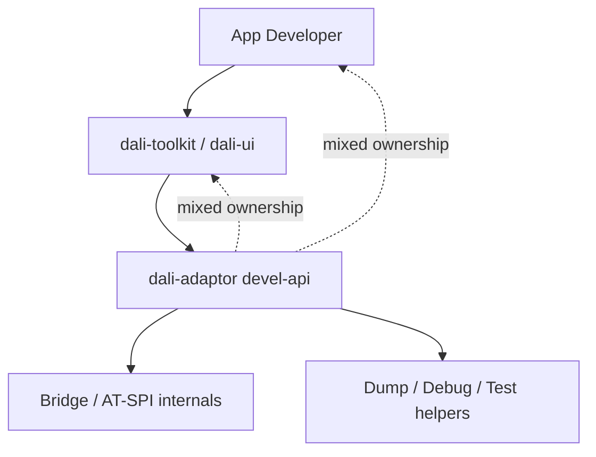
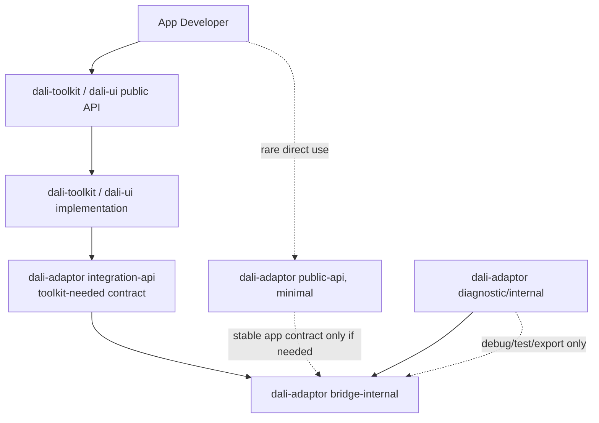

# DALi Accessibility Refactoring Report

## 1. Summary

현재 DALi Accessibility 구조는 `dali-adaptor devel-api`에 app-facing API, Toolkit/UI 연동 contract, DBus/AT-SPI bridge 내부 API가 함께 노출되어 있다. 이 때문에 App 개발자, Toolkit/UI component 개발자, adaptor bridge 구현자가 각각 어느 API에 의존해야 하는지 경계가 흐리다.

개선 방향은 API 경계를 먼저 정리하고, 이후 내부 책임을 단계적으로 재배치하는 것이다.

- App은 `dali-toolkit`/`dali-ui`의 AccessibilityData 또는 AccessibilitySemantics API를 사용한다.
- Toolkit/UI는 `dali-adaptor integration-api`의 최소 contract만 사용한다.
- `dali-adaptor`는 DBus/AT-SPI bridge, object registry, Accessible adapter 소유와 구현을 담당한다.
- `dali-csharp-binder`/NUI ABI는 유지하고, 필요한 경우 compatibility wrapper를 둔다.

## 2. Current Problem

현재 구조의 가장 큰 문제는 사용자 API와 플랫폼/bridge API가 분리되어 있지 않다는 점이다.



- `dali-adaptor devel-api`에 accessibility enum, bitset, `Accessible`, `ActorAccessible`, `Bridge`, AT-SPI interface header가 함께 노출되어 있다.
- App 개발자가 직접 알 필요 없는 bridge 구현 타입이나 diagnostic API까지 볼 수 있다.
- Toolkit/UI는 adaptor와 연동하기 위해 필요한 최소 contract가 아니라, adaptor의 `ActorAccessible`과 AT-SPI style type에 직접 결합되어 있다.

## 3. Target Direction

목표 구조는 사용자 API, Toolkit/UI 연동 API, adaptor 내부 구현을 분리하는 것이다.



- `dali-toolkit`/`dali-ui public API`: App 개발자가 접근성 정보를 설정하는 기본 API.
- `dali-adaptor public-api`: App이나 framework가 직접 써야 하는 아주 작은 안정 API.
- `dali-adaptor integration-api`: Toolkit/UI가 adaptor와 연동하기 위한 최소 contract.
- `dali-adaptor bridge-internal`: DBus/AT-SPI bridge, object registry, Accessible adapter 구현.
- `dali-adaptor diagnostic/internal`: dump, debug, test, automation 보조 기능.

## 4. Accessible Ownership Direction

현재 Toolkit/UI는 semantic 정보 제공자이면서 동시에 adaptor의 `Accessible` 구현체 역할까지 맡고 있다.

목표는 Toolkit/UI가 UI 의미 정보만 제공하고, 외부 accessibility object 생성과 protocol 변환은 adaptor가 담당하도록 나누는 것이다.

```text
Current:
  Toolkit/UI creates ControlAccessible/ViewAccessible
  ControlAccessible/ViewAccessible inherits adaptor ActorAccessible
  Toolkit/UI directly uses AT-SPI style types

Target:
  Toolkit/UI owns/provides Accessibility Semantics
  dali-adaptor creates/owns Accessible Adapter
  dali-adaptor converts semantics to DBus/AT-SPI
```

이 변경은 Phase 5에서 진행한다. Phase 1에서는 ownership과 `RegisterExternalAccessibleGetter()` contract를 변경하지 않는다.

## 5. Phased Plan

| Phase | Goal |
|---|---|
| Phase 0 | 현재 API를 `public`, `toolkit-needed`, `bridge-internal`, `diagnostic`으로 분류한다. |
| Phase 1 | `dali-adaptor` API 노출을 줄이고, 기존 devel include는 deprecated wrapper로 유지한다. |
| Phase 2 | Toolkit/UI에 새 AccessibilityData 또는 AccessibilitySemantics API를 추가한다. |
| Phase 3 | 기존 Control/View accessibility property API를 새 API로 위임한다. |
| Phase 4 | highlight 표시를 별도 accessibility plane 중심으로 개선한다. |
| Phase 5 | Toolkit/UI와 adaptor의 책임을 재배치하고, Accessible ownership을 adaptor로 옮긴다. |
| Phase 6 | AT-SPI adapter 의존을 내부화하고 backend 독립성을 높인다. |

## 6. Compatibility Strategy

`dali-csharp-binder`는 NUI ABI를 유지해야 하므로 별도 호환 경로가 필요하다.

- 기존 C ABI 함수 이름과 signature는 유지한다.
- `dali-toolkit`의 legacy property enum/value는 유지한다.
- 필요한 adaptor 타입은 `integration-api` compatibility wrapper로 임시 제공할 수 있다.
- 기존 `devel-api` include 경로는 deprecated forwarding header로 일정 기간 유지한다.
- `dali-ui`는 binder ABI 호환 책임이 없으므로 새 AccessibilityData/Semantics API 중심으로 더 과감하게 정리할 수 있다.

## 7. Phase 1 Risk Control

Phase 1은 API 노출 범위를 줄이는 단계이며 내부 구조를 크게 바꾸지 않는다.

- `Accessible` ownership은 변경하지 않는다.
- `RegisterExternalAccessibleGetter()` contract는 변경하지 않는다.
- `NUIViewAccessible` 상속 구조는 변경하지 않는다.
- `dali-csharp-binder`가 제공하는 C ABI는 유지한다.
- 기존 devel header는 바로 삭제하지 않고 deprecated compatibility layer로 유지한다.

이렇게 하면 API 경계를 정리하면서도 NUI/binder 호환성과 기존 동작 안정성을 유지할 수 있다.

## 8. Expected Result

- App 개발자는 Toolkit/UI의 명확한 Accessibility API만 사용하게 된다.
- Toolkit/UI는 adaptor 내부 bridge 구현에 직접 결합되지 않는다.
- `dali-adaptor`는 외부 process와의 DBus/AT-SPI 통신 책임을 명확히 가진다.
- 장기적으로 AT-SPI 외의 backend가 필요해져도 Toolkit/UI API를 크게 흔들지 않고 adaptor 내부 adapter만 교체할 수 있는 기반을 만든다.
