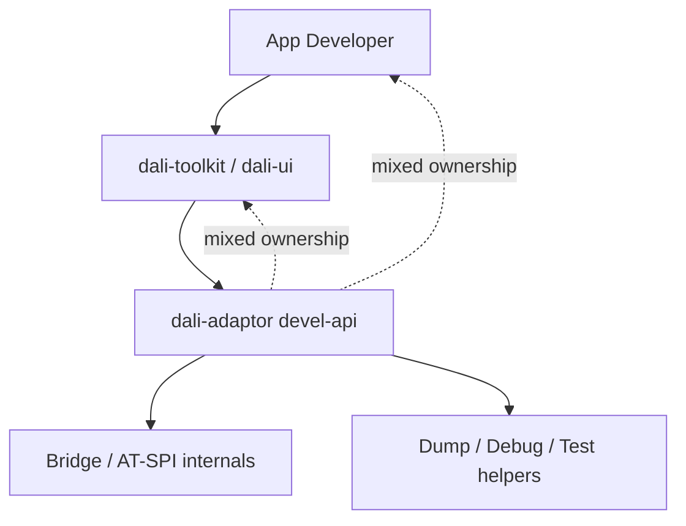
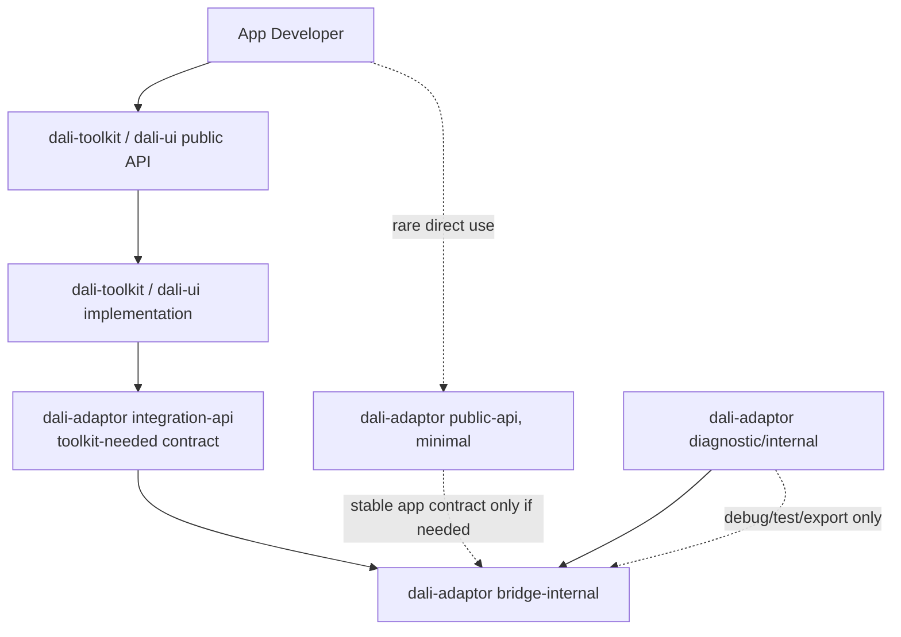
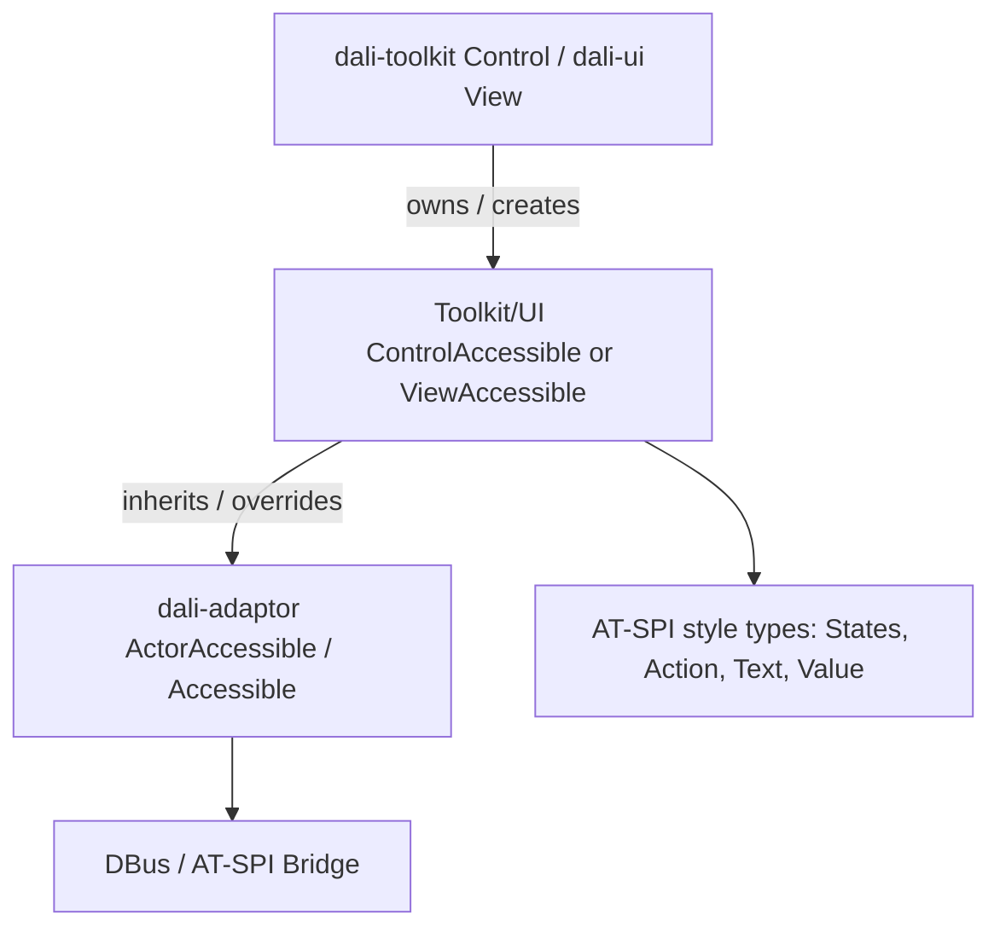
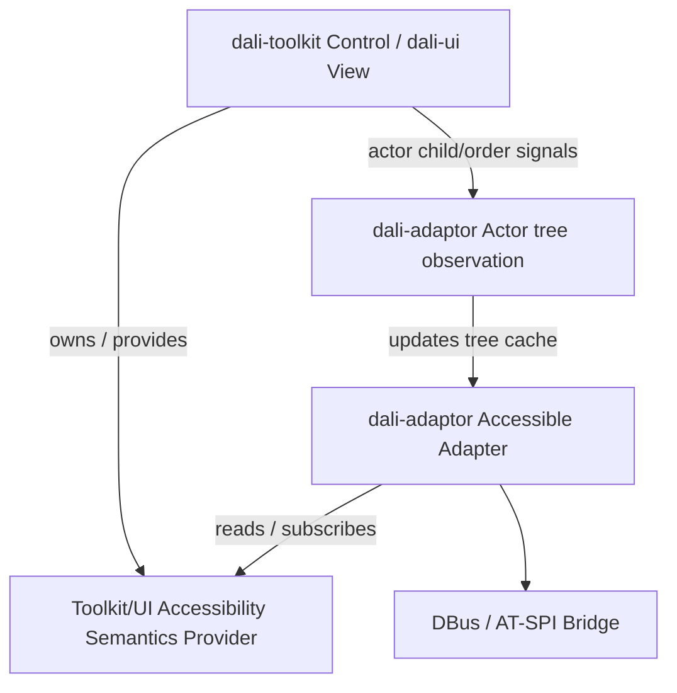

# Phase 0 - API 분류

## 목적

현재 Accessibility 관련 API를 먼저 분류한다. 이 단계에서는 동작을 바꾸지 않고, 어떤 API가 누구를 위한 계약인지 명확히 한다.

## 해결해야 할 문제

- API 계층 혼재
  - `dali-adaptor devel-api`에 app-facing API, Toolkit/UI 연동 contract, DBus/AT-SPI bridge 내부 API, diagnostic API가 함께 노출되어 있다.
  - 그 결과 App 개발자, Component 개발자, Toolkit/UI 구현, adaptor bridge 구현이 각각 어느 API에 의존해야 하는지 경계가 흐리다.

- Toolkit/UI와 adaptor의 강한 결합
  - Toolkit/UI는 semantic 정보만 제공하면 되는 계층이어야 하지만, 현재는 `ControlAccessible`/`ViewAccessible`이 adaptor의 `ActorAccessible`을 상속하고 AT-SPI 스타일 타입을 직접 사용한다.
  - 최종적으로는 Toolkit/UI가 Accessibility semantics를 제공하고, `Accessible` 객체 생성과 bridge 변환은 adaptor가 담당하도록 분리해야 한다.

- Toolkit-adaptor interface 과다 노출
  - `accessibility-bitset.h` 같은 helper type이 `States`, `ReadingInfoTypes`, `AtspiInterfaces`의 기반 타입으로 공개되어 있다.
  - Toolkit/UI가 알아야 하는 최소 contract인지, adaptor 내부 helper인지 재분류해야 한다.

- `accessibility.h`/`accessibility.cpp`의 구조적 문제
  - `accessibility.h`에는 `Role` 같은 public semantic enum, `AtspiEvent` 같은 bridge/backend 타입, `Address` 같은 class, public data member struct가 한 파일에 섞여 있다.
  - `Address`는 `std::string` member를 직접 가진 concrete class라 DALi public API의 p-impl/BaseHandle 방식과 맞지 않는다.
  - `Point`, `Size`, `Range`, `GestureInfo`, `Relation`, `ActionInfo` 같은 struct는 public에 남길 경우 필드 변경이 ABI/API에 직접 영향을 준다.
  - `Relation`처럼 public header에서 `Accessible*`를 노출하는 타입은 public semantic API와 adaptor 내부 accessibility object 모델을 결합시킨다.
  - `accessibility.cpp`는 `Address`, `Accessible`, `Bridge`, 내부 `AdaptorAccessible` 구현을 함께 담고 있어 header/source 책임과 API 계층 경계가 불명확하다.

- public API ABI 안정성
  - public-api로 나가는 class는 DALi public API 규칙에 맞게 p-impl/BaseHandle/BaseObject 구조를 검토해야 한다.
  - 단순 enum이라도 app-facing semantic enum인지, Toolkit-only enum인지, bridge/internal enum인지 분리해야 한다.

- 호환성 책임 차이
  - `dali-core`와 `dali-adaptor`는 공용 기반이므로 public ABI를 보수적으로 지켜야 한다.
  - `dali-toolkit`은 `dali-csharp-binder`/NUI ABI 호환성을 고려해야 하지만, `dali-ui`는 상대적으로 새 API 중심으로 더 과감하게 정리할 수 있다.

## 보고 요약

현재 구조의 핵심 문제는 `dali-adaptor devel-api`에 app-facing API, Toolkit/UI 연동 contract, DBus/AT-SPI bridge 내부 API가 섞여 있다는 점이다. 이 때문에 App 개발자, Toolkit/UI component 개발자, adaptor bridge 구현자가 각각 어느 API에 의존해야 하는지 경계가 흐리다.

목표 방향은 다음과 같다.

- App은 `dali-toolkit`/`dali-ui`의 AccessibilityData 또는 AccessibilitySemantics API를 사용한다.
- Toolkit/UI는 `dali-adaptor integration-api`의 최소 contract만 사용한다.
- `dali-adaptor`는 DBus/AT-SPI bridge, object registry, Accessible adapter 소유와 구현을 담당한다.
- `dali-csharp-binder`/NUI ABI는 유지하고, 필요한 경우 제한된 integration contract를 둔다.

단계적 접근은 다음과 같다.

- Phase 0: 현재 API를 `public`, `toolkit-needed`, `bridge-internal`, `diagnostic`으로 분류한다.
- Phase 1: adaptor API 노출을 줄이고, include 사용처를 public/integration 경로로 직접 정리한다.
- Phase 2~3: Toolkit/UI에 새 AccessibilityData/Semantics API를 추가하고, 기존 property API를 새 API로 위임한다.
- Phase 5~6: Accessible ownership을 adaptor로 옮기고, AT-SPI adapter 의존을 내부화한다.

리스크 제어를 위해 Phase 1에서는 `Accessible` ownership과 `RegisterExternalAccessibleGetter()` contract를 변경하지 않는다. 해당 구조 변경은 Phase 5에서 수행한다.

## 분류 기준

- `public`: App 개발자가 직접 사용하는 안정 API.
- `toolkit-needed`: `dali-toolkit` 또는 `dali-ui`가 adaptor와 연동하기 위해 필요한 최소 API.
- `bridge-internal`: DBus/AT-SPI bridge 구현에 필요한 내부 API.
- `diagnostic`: dump, debug, test, automation 보조용 API.

## 주요 대상

- `dali-adaptor/dali/devel-api/adaptor-framework/accessibility*.h`
- `dali-adaptor/dali/devel-api/atspi-interfaces/*.h`
- `dali-toolkit/dali-toolkit/devel-api/controls/control-accessible.h`
- `dali-ui/dali-ui-foundation/integration-api/view-accessible.h`
- Toolkit/UI에서 직접 include하는 adaptor accessibility header들

## 주의점

`accessibility-bitset.h`는 겉보기에는 유틸리티지만 현재 `States`, `ReadingInfoTypes`, `AtspiInterfaces` 등의 기반 타입으로 노출되어 있다. 바로 숨기기보다 먼저 대체 semantic 타입이나 wrapper를 준비해야 한다.

`Accessible`, `Action`, `Text`, `Value`, `Selection` 계열은 Toolkit/UI 구현에 쓰이고 있으므로 app-facing API인지 internal contract인지 구분해야 한다.

현재 Toolkit/UI는 adaptor header를 단순 include하는 수준을 넘어서 `ControlAccessible`/`ViewAccessible`이 `ActorAccessible`을 상속하고 `Dali::Accessibility::States` 같은 AT-SPI 쪽 signature를 직접 구현한다. 따라서 Phase 0에서는 header 위치뿐 아니라 상속, 반환 타입, callback contract까지 함께 분류해야 한다.

모듈별 호환성 책임은 다르게 본다. `dali-core`와 `dali-adaptor`는 공용 기반이므로 노출 API를 보수적으로 정리하고, `dali-toolkit`은 `dali-csharp-binder`/NUI 호환성을 유지해야 한다. 반면 `dali-ui`는 binder ABI 호환 책임이 없으므로 새 Accessibility API 중심으로 더 과감하게 정리할 수 있다.

다만 `dali-toolkit`과 `dali-ui`를 완전히 다른 모델로 개발하지는 않는다. 가능한 한 같은 Accessibility semantics 모델을 공유하고, 호환이 필요한 일부 경로만 `integration-api` contract 또는 legacy property delegation으로 유지한다.

## 완료 기준

- 모든 accessibility header가 네 분류 중 하나로 태깅된다.
- public으로 유지할 API와 내릴 API 목록이 정리된다.
- integration contract로 유지할 API 목록이 정리된다.
- Toolkit/UI가 실제로 필요로 하는 adaptor API 최소 목록이 나온다.

## Overall Architecture

### As-Is Diagram

이 구조의 문제는 app-facing API, Toolkit 연동 contract, bridge 내부 구현, diagnostic 기능이 같은 API 표면에 섞여 있다는 점이다. API를 사용하는 쪽에서 무엇이 안정 계약이고 무엇이 내부 구현 세부인지 구분하기 어렵다.

- 모듈 설명
  - `App Developer`: 앱에서 Toolkit/UI API를 사용해 accessibility 정보를 설정하는 사용자.
  - `dali-toolkit / dali-ui`: `ControlAccessible`/`ViewAccessible` 등을 통해 DALi control/view의 accessibility 정보를 adaptor 쪽 `Accessible` 모델로 제공하는 계층.
  - `dali-adaptor devel-api`: accessibility enum, bitset, `Accessible`, `ActorAccessible`, `Bridge`, AT-SPI interface header가 함께 노출된 현재 API 표면.
  - `Bridge / AT-SPI internals`: DBus object, AT-SPI method/property/signal 처리, object registry 등 bridge 구현 세부.
  - `Dump / Debug / Test helpers`: tree dump, node info, debug/test/automation 보조 기능.

- App Developer - `dali-adaptor devel-api` mixed ownership
  - App 개발자가 직접 알 필요가 없는 bridge 구현 타입, AT-SPI helper, diagnostic API까지 devel API 경로를 통해 볼 수 있다는 의미다.
  - 예시: App 개발자에게는 접근성 role/state 설정 API 정도만 필요하지만, `Bridge`, `Accessible`, `ActorAccessible`, `DumpTree` 계열 구현 세부까지 같은 devel API 영역에 노출된다.

- `dali-toolkit / dali-ui` - `dali-adaptor devel-api` mixed ownership
  - Toolkit/UI가 adaptor와 연동하기 위해 필요한 최소 contract와 bridge 구현 세부가 같은 API 표면에 섞여 있다는 의미다.
  - 예시: Toolkit/UI는 "이 Control의 name, role, state를 제공한다"는 semantic contract만 알면 되지만, 현재는 `ControlAccessible`/`ViewAccessible`이 adaptor의 `ActorAccessible`을 상속하고 AT-SPI `States` 같은 타입을 override signature로 직접 사용한다.

### To-Be Diagram

이 구조의 장점은 App, Toolkit/UI, adaptor bridge, diagnostic의 책임과 API 안정성 수준을 분리할 수 있다는 점이다. 이후 Phase에서 실제 header 이동이나 integration contract를 적용할 때 어느 경계를 지켜야 하는지 기준이 된다.

- 관계 설명
  - `App --> dali-toolkit / dali-ui public API`: 일반 앱 개발자의 기본 접근 경로다. 접근성 속성 설정은 이 계층에서 해결되어야 한다.
  - `App -. rare direct use .-> dali-adaptor public-api, minimal`: Toolkit/UI를 거치지 않고 adaptor/platform 기능을 직접 써야 할 때만 허용되는 예외 경로다.
  - `Toolkit --> dali-adaptor integration-api (toolkit-needed contract)`: Toolkit/UI implementation이 adaptor와 연동하기 위한 최소 C++ 계약이다. 이 계약은 app-facing API가 아니다.
  - `dali-adaptor integration-api (toolkit-needed contract) --> dali-adaptor bridge-internal`: Toolkit/UI가 제공한 semantic 정보를 bridge 내부 구현이 DBus/AT-SPI 형태로 변환하는 경계다.
  - `dali-adaptor diagnostic/internal --> dali-adaptor bridge-internal`: dump/debug/test 기능은 bridge 내부 정보를 사용할 수 있지만 안정적인 외부 API로 취급하지 않는다.

- `dali-toolkit / dali-ui public API`
  - App 개발자가 주로 사용하는 accessibility API다.
  - 예시: `Control`/`View`의 새 `AccessibilityData` 또는 `AccessibilitySemantics` API.

- `dali-adaptor public-api, minimal`
  - App 개발자가 Toolkit/UI를 거치지 않고 직접 써야 하는 아주 작은 안정 API가 있을 때만 둔다.
  - 예시: accessibility enabled 상태 조회나 screen reader 제어처럼 adaptor/platform에 가까운 API.

- `dali-adaptor integration-api (toolkit-needed contract)`
  - Toolkit/UI implementation이 adaptor와 연동하기 위해 필요한 최소 C++ contract다.
  - App 개발자에게 직접 노출되는 영역이 아니다.

- `dali-adaptor bridge-internal`
  - DBus/AT-SPI bridge, object registry, `Accessible` 구현 세부처럼 adaptor 내부에 가까운 영역이다.
  - 최종 목표 관점에서는 `Accessible`/`ActorAccessible` 객체의 생성과 소유도 Toolkit/UI가 아니라 adaptor 쪽 책임으로 분류한다.

- `dali-adaptor diagnostic/internal`
  - dump, debug, test, automation 보조용 API다.
  - 안정적인 app-facing 계약으로 취급하지 않는다.

## Accessible Relationship

### As-Is Diagram

이 구조의 문제는 Toolkit/UI가 semantic 정보 제공자이면서 동시에 adaptor의 `Accessible` 구현체 역할까지 맡는다는 점이다. 그 결과 Toolkit/UI가 AT-SPI 표현 타입과 bridge 구현 세부에 직접 결합된다.

- 모듈 설명
  - `dali-toolkit Control / dali-ui View`: 실제 UI component state와 accessibility property/signal/virtual hook을 가진 객체.
  - `Toolkit/UI ControlAccessible or ViewAccessible`: 현재 Toolkit/UI가 생성하는 accessibility adapter 객체.
  - `dali-adaptor ActorAccessible / Accessible`: adaptor가 정의한 accessibility object base와 AT-SPI에 가까운 C++ interface.
  - `AT-SPI style types`: `States`, `Action`, `Text`, `Value`처럼 adaptor accessibility model에 속한 타입.
  - `DBus / AT-SPI Bridge`: 외부 프로세스와 통신하는 bridge 구현.

- 관계 설명
  - `Control -- owns / creates --> ToolkitAccessible`: 현재 구조에서는 Toolkit/UI의 Control/View 구현이 `CreateAccessibleObject()` 등을 통해 `ControlAccessible`/`ViewAccessible`을 생성하고 보유한다.
  - `ToolkitAccessible -- inherits / overrides --> AdaptorAccessible`: Toolkit/UI가 adaptor의 `ActorAccessible`을 상속하고 `GetStates()`, `GetName()`, `DoAction()` 같은 `Accessible` contract를 직접 구현한다.
  - `ToolkitAccessible --> AT-SPI style types`: Toolkit/UI 구현체가 `Dali::Accessibility::States` 같은 adaptor/AT-SPI 표현 타입을 직접 사용한다.
  - 이 구조에서는 Toolkit/UI가 semantic 정보 제공자이면서 동시에 외부 accessibility adapter 역할까지 함께 맡는다.

### To-Be Diagram

이 구조의 장점은 Toolkit/UI가 UI 의미 정보만 제공하고, 외부 accessibility object 생성과 protocol 변환은 adaptor가 담당하도록 책임을 나눈다는 점이다. 이를 통해 Toolkit/UI API가 AT-SPI backend에 덜 묶인다.

- 모듈 설명
  - `Toolkit/UI Accessibility Semantics Provider`: name, role, state, value, action 가능 여부 같은 UI 의미 정보를 제공하는 contract.
  - `dali-adaptor Accessible Adapter`: Toolkit/UI semantic 정보를 외부 accessibility object로 감싸는 adaptor 소유 객체.
  - `dali-adaptor Actor tree observation`: 별도 app-facing 모듈이 아니라, parent/child/order 변화 같은 actor tree 변경을 adaptor가 관찰하는 내부 역할.

- 관계 설명
  - `Control -- owns / provides --> Semantics`: Control/View가 accessibility semantic data와 action hook을 소유하거나 제공한다.
  - `Control -- actor child/order signals --> Actor tree observation`: 부모-자식 관계와 actor tree 변경은 adaptor가 Actor signal을 관찰해서 반영한다.
  - `AdaptorAdapter -- reads / subscribes --> Semantics`: adaptor의 `Accessible` adapter가 semantic provider에서 name/role/state/value/action 정보를 읽고, semantic change signal을 구독한다.
  - 최종 목표에서는 `Accessible`/`ActorAccessible` 객체의 생성과 소유가 Toolkit/UI가 아니라 adaptor 쪽 책임으로 분리된다.
