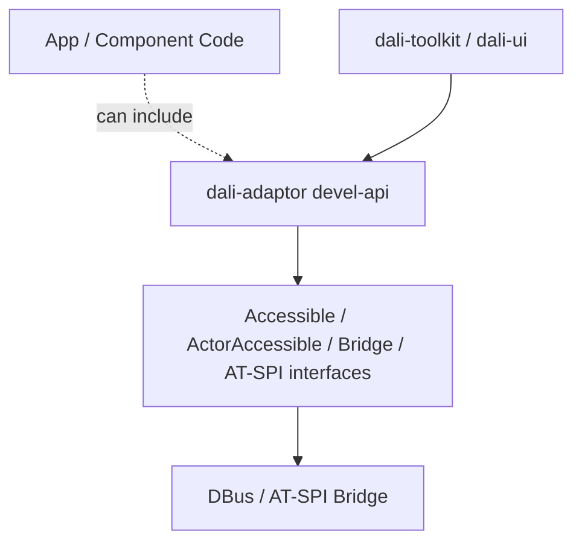
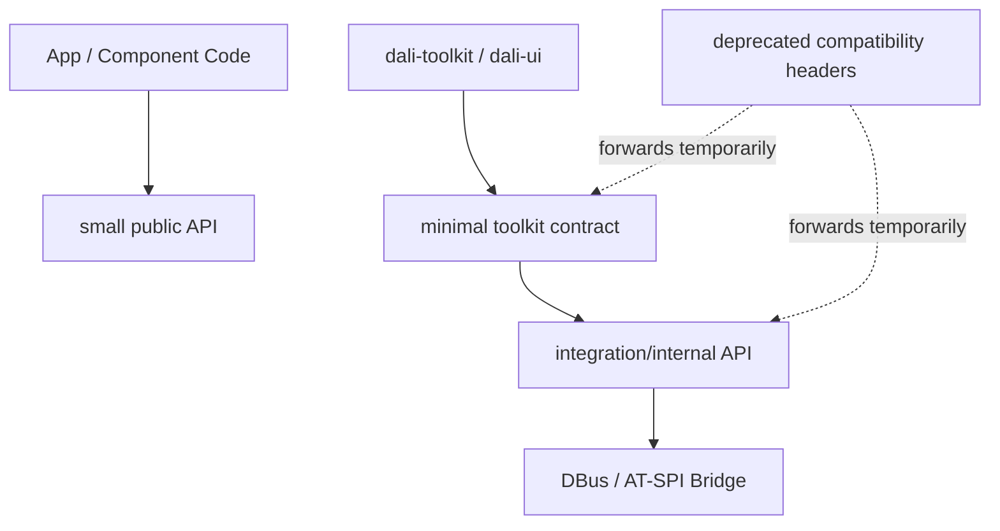

# Phase 1 - dali-adaptor API 최소화

## 목적

`dali-adaptor`에 열려 있는 Accessibility C++ API를 줄인다. 외부 프로세스의 런타임 계약은 DBus/AT-SPI이므로, C++ devel API에 bridge 구현 세부가 넓게 노출되지 않도록 한다.

## 작업 방향

- App 개발자에게 필요한 안정 API만 `public-api` 후보로 둔다.
- Toolkit/UI 연동에 필요한 최소 타입과 함수만 별도 contract로 남긴다.
- AT-SPI bridge 구현체, DBus object, object registry, diagnostic helper는 internal 또는 integration 영역으로 내린다.
- 기존 devel API는 바로 삭제하지 않고 deprecated wrapper를 둔다.

## public 후보

- DALi semantic enum: role, state, relation, action 등.
- accessibility enabled 상태 조회.
- 앱이 명시적으로 사용하는 screen reader control API가 있다면 제한적으로 검토한다.

## internal/integration 후보

- `Bridge`
- `ActorAccessible`
- `ProxyAccessible`
- `Accessible` 구현체 계열
- `atspi-interfaces`의 `Action`, `Text`, `Value`, `Selection`, `EditableText`, `Hypertext` 등
- DBus serialization helper
- dump/navigation/diagnostic API

## 주의점

현재 Toolkit/UI가 adaptor의 AT-SPI 타입을 직접 상속하거나 include하는 지점이 많다. API 위치만 옮기면 빌드가 깨지므로, wrapper 또는 compatibility include를 먼저 둬야 한다.

## 완료 기준

- app-facing header에서 bridge 구현 세부가 제거된다.
- Toolkit/UI가 사용하는 최소 adaptor contract가 문서화된다.
- 기존 include 경로는 deprecated 상태로 일정 기간 유지된다.

## As-Is Diagram

## To-Be Diagram

