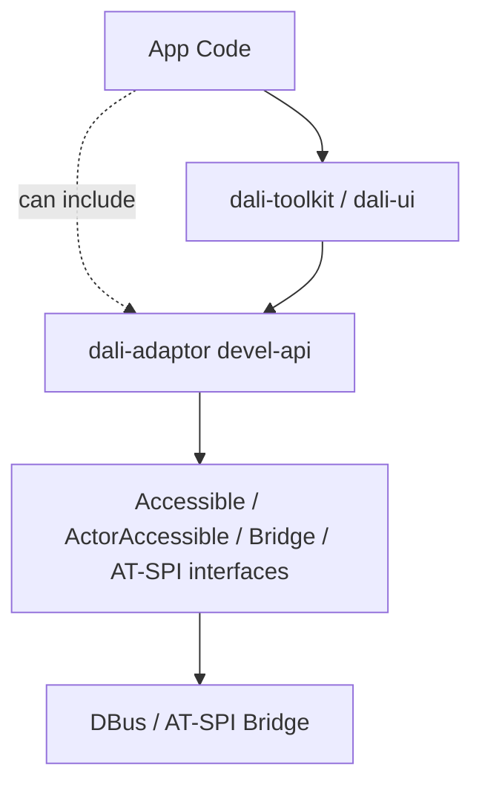
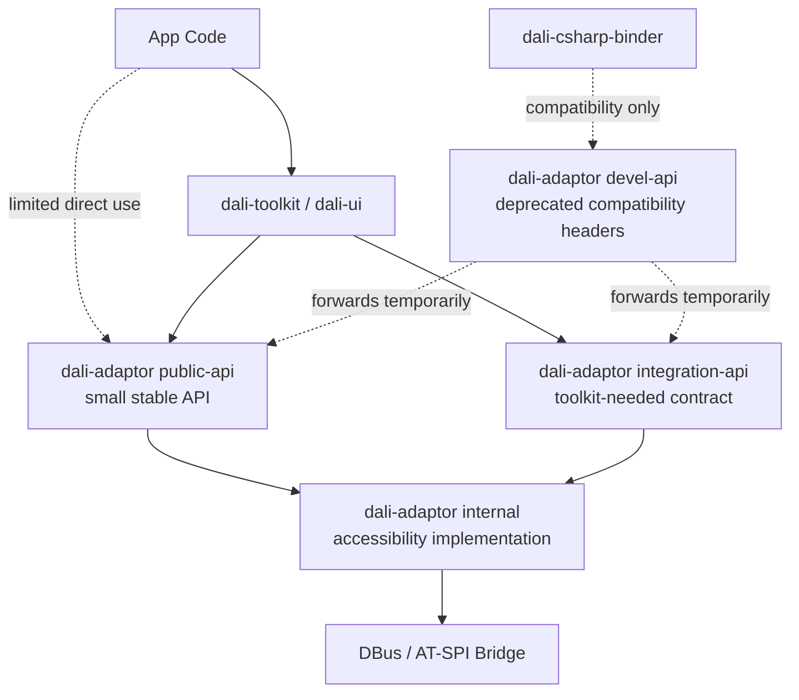

# Phase 1 - dali-adaptor API 최소화

## 목적

`dali-adaptor`에 열려 있는 Accessibility C++ API를 줄인다. 특히 `dali-adaptor`와 `dali-toolkit`/`dali-ui` 사이 interface를 최대한 얇게 만든다. 외부 프로세스의 런타임 계약은 DBus/AT-SPI이므로, C++ devel API에 bridge 구현 세부가 넓게 노출되지 않도록 한다.

## 작업 방향

- App 개발자에게 필요한 안정 API만 `public-api` 후보로 둔다.
- Toolkit/UI 연동에 필요한 최소 타입과 함수만 별도 contract로 남긴다.
- `accessibility-bitset.h` 같은 helper type은 toolkit-adaptor 경계에서 원칙적으로 제거한다.
- AT-SPI bridge 구현체, DBus object, object registry, diagnostic helper는 internal 또는 integration 영역으로 내린다.
- `dali-csharp-binder` 호환 때문에 필요한 API는 임시로 `integration-api` 또는 deprecated devel wrapper에 남긴다.
- 기존 devel API는 바로 삭제하지 않고 deprecated wrapper를 둔다.

## public 후보

- DALi semantic enum: role, state, relation, action 등.
- accessibility enabled 상태 조회.
- 앱이 명시적으로 사용하는 screen reader control API가 있다면 제한적으로 검토한다.

## internal/integration 후보

- `Bridge`
- `ActorAccessible`
- `ProxyAccessible`
- `Accessible` 구현체 계열
- `accessibility-bitset.h` 같은 helper type. 단, 가능하면 Toolkit/UI contract에서는 제거한다.
- `atspi-interfaces`의 `Action`, `Text`, `Value`, `Selection`, `EditableText`, `Hypertext` 등
- DBus serialization helper
- dump/navigation/diagnostic API

## binder 영향 API 분류

`dali-csharp-binder`가 직접 사용하는 API는 다음 기준으로 유지한다.

| 현재 사용 API | Phase 1 처리 |
|---|---|
| `AtspiAccessibility::IsEnabled`, `IsScreenReaderEnabled` | public 후보 |
| `AtspiAccessibility::Say`, `Pause`, `Resume`, `StopReading`, `SuppressScreenReader` | public 또는 제한적 public 후보 |
| `Bridge::EnabledSignal`, `ScreenReaderEnabledSignal` | public/devel 후보 |
| `Bridge::GetCurrentBridge`, `RegisterDefaultLabel`, `UnregisterDefaultLabel` | integration-api 후보 |
| `Accessible::Get`, `GetOwningPtr`, `GetHighlightActor`, `SetHighlightActor` | integration-api compatibility 후보 |
| `ActorAccessible::Emit*`, `EmitText*`, `EmitScroll*` | integration-api 후보 |
| `GetSuppressedEvents`, `AtspiEvent` | integration-api 또는 diagnostic/internal 후보 |
| `Text`, `EditableText`, `Selection`, `Value` 등 AT-SPI feature interface 상속 | Phase 1에서는 integration-api로 유지, Phase 5에서 semantics/provider로 대체 |
| `Range`, `GestureInfo`, `ActionInfo`, `Role`, `State`, `RelationType` | semantic public type 후보 |

주요 binder 사용 지점은 `dali-csharp-binder/dali-adaptor/atspi-wrap.cpp`, `dali-csharp-binder/dali-toolkit/control-devel-wrap.cpp`, `dali-csharp-binder/legacy/nui-view-accessible.*`, `dali-csharp-binder/common/signal-wrap.cpp`이다.

## 작업 순서

1. 현재 accessibility header와 binder 사용 API를 `public`, `integration`, `internal`, `diagnostic`으로 태깅한다.
2. app-facing으로 남길 enum/type과 screen reader control API를 먼저 확정한다.
3. binder/toolkit이 필요한 비공개성 API는 `integration-api` compatibility wrapper로 제공한다.
4. 기존 `devel-api` include 경로는 deprecated forwarding header로 유지한다.
5. `dali-toolkit`, `dali-ui`, `dali-csharp-binder` include를 가능한 범위에서 새 위치로 옮긴다.
6. `Accessible` ownership, `RegisterExternalAccessibleGetter()` contract, `NUIViewAccessible` 상속 구조 변경은 Phase 5로 넘긴다.

## 주의점

현재 Toolkit/UI가 adaptor의 AT-SPI 타입을 직접 상속하거나 include하는 지점이 많다. API 위치만 옮기면 빌드가 깨지므로, wrapper 또는 compatibility include를 먼저 둬야 한다.

Phase 1의 목표는 단순히 header 위치를 바꾸는 것이 아니라 Toolkit/UI가 알아야 하는 adaptor type 수를 줄이는 것이다. 예를 들어 `States`, `ReadingInfoTypes`, `AtspiInterfaces`를 위해 노출된 `accessibility-bitset.h`는 가능한 한 Toolkit/UI 경계에서 제거한다. 단, `dali-csharp-binder` 호환 때문에 당장 필요한 경우에는 임시 compatibility API로만 유지한다.

Phase 1은 `Accessible` ownership이나 `RegisterExternalAccessibleGetter()` contract를 변경하지 않는다. 해당 구조 변경은 Phase 5에서 수행한다. Phase 1에서는 기존 구조를 보존한 상태로 API 노출 범위만 축소한다.

`dali-csharp-binder`는 NUI ABI를 유지해야 하므로 별도 호환 경로가 필요하다.

- binder가 사용하는 기존 C ABI 함수 이름과 signature는 유지한다.
- binder 내부 구현이 여전히 필요한 adaptor 타입은 `integration-api` compatibility wrapper를 통해 임시로 제공할 수 있다.
- wrapper는 신규 app-facing API가 아니라 binder/toolkit 이행용 contract로 취급한다.
- wrapper는 기존 header를 단순히 다시 public surface로 노출하는 형태가 되지 않도록, 사용 주체와 제거 시점을 명시한다.

## 완료 기준

- app-facing header에서 bridge 구현 세부가 제거된다.
- Toolkit/UI가 사용하는 최소 adaptor contract가 문서화된다.
- `accessibility-bitset.h` 같은 helper type은 toolkit-adaptor 경계에서 제거되거나 compatibility 목적으로만 남는다.
- 기존 include 경로는 deprecated 상태로 일정 기간 유지된다.
- `dali-csharp-binder`가 제공하는 C ABI를 유지한 채 빌드 가능한 호환 경로가 있다.

## As-Is Diagram

이 구조의 문제는 사용자 API와 플랫폼/bridge API가 모두 `dali-adaptor devel-api`에 섞여 있다는 점이다. App code가 원칙적으로 알 필요 없는 bridge 내부 타입까지 볼 수 있고, component 구현을 포함한 Toolkit/UI도 필요한 최소 contract가 아니라 adaptor의 AT-SPI 모델을 직접 include하거나 상속한다.

- 모듈 설명
  - `App Code`: 앱 코드. 원래는 toolkit/ui API만 사용해 accessibility 정보를 설정하는 것이 이상적이다.
  - `dali-toolkit / dali-ui`: component 구현 코드를 포함하는 UI 계층이다. `ControlAccessible`, `ViewAccessible` 등을 통해 DALi control/view 정보를 adaptor accessibility 모델로 제공한다.
  - `dali-adaptor devel-api`: 현재 accessibility enum, helper, bridge API, AT-SPI interface가 함께 노출된 넓은 API 표면이다. 예를 들어 `accessibility-bitset.h`는 `States`, `ReadingInfoTypes`, `AtspiInterfaces` 등의 기반 helper로 이 영역에 노출되어 있다.
  - `Accessible / ActorAccessible / Bridge / AT-SPI interfaces`: 실제 DBus/AT-SPI bridge와 가까운 타입들이다.
  - `DBus / AT-SPI Bridge`: 외부 프로세스와 통신하는 runtime bridge 구현이다.

- 관계 설명
  - `App -. can include .-> DevelAPI` 점선은 앱이 항상 직접 사용한다는 뜻이 아니라, API 표면상 include 가능하다는 의미다.
  - `Toolkit --> DevelAPI`는 Toolkit/UI가 adaptor devel API의 넓은 surface에 직접 의존한다는 의미다.
  - 이 상태에서는 app-facing API, Toolkit 연동 contract, bridge 내부 타입의 경계가 흐려진다.

## To-Be Diagram

이 구조의 장점은 사용자 API, Toolkit/UI 연동 API, adaptor 내부 로직을 분리한다는 점이다. `integration-api`는 API 경계이고, `internal`은 API가 아니라 실제 bridge/object registry/event 처리 로직이다.

- 모듈 설명
  - `App Code`: 기본적으로 `dali-toolkit / dali-ui` API를 통해 accessibility를 설정한다.
  - `dali-toolkit / dali-ui`: app-facing UI 계층이며 component 구현 코드를 포함한다. 공용 안정 API와 toolkit-needed contract를 사용한다.
  - `dali-csharp-binder`: NUI ABI 호환을 위해 기존 devel include 경로를 임시로 사용할 수 있는 binder 계층이다.
  - `dali-adaptor public-api`: app이나 framework가 제한적으로 직접 사용할 수 있는 작고 안정적인 API다. 예를 들어 semantic enum, enabled 상태 조회, 제한적인 screen reader control API가 후보가 될 수 있다.
  - `dali-adaptor integration-api`: Toolkit/UI가 adaptor와 연동하기 위해 사용하는 최소 contract다. binder도 이행 후 이 contract를 사용할 수 있지만, Phase 1에서는 deprecated compatibility header를 통해 임시로 접근할 수 있다. app-facing public API가 아니다.
  - `dali-adaptor devel-api`: 기존 include 경로 호환을 위한 deprecated forwarding layer다.
  - `dali-adaptor internal`: `Accessible`, `ActorAccessible`, object registry, DBus/AT-SPI bridge 구현 등 실제 로직이 위치하는 영역이다.

- 관계 설명
  - `App --> Toolkit`이 기본 경로다. app은 가능하면 toolkit/ui의 AccessibilityData/Semantics API만 사용한다.
  - `App -. limited direct use .-> dali-adaptor public-api`는 예외적으로 필요한 작은 안정 API만 허용한다는 의미다.
  - `Toolkit --> dali-adaptor public-api`는 Toolkit/UI도 공용 semantic enum이나 enabled 상태 조회 같은 안정 API를 사용할 수 있다는 의미다.
  - `Toolkit --> dali-adaptor integration-api`는 Toolkit/UI가 adaptor 내부 타입 전체가 아니라 최소 contract만 사용한다는 의미다.
  - `dali-csharp-binder -. compatibility only .-> deprecated compatibility headers`는 binder ABI 유지를 위한 임시 호환 경로다. 새 app-facing API가 아니다.
  - `public-api`와 `integration-api`는 모두 `dali-adaptor internal` 구현으로 연결되지만, 외부에 노출되는 경계는 서로 다르다.
  - `deprecated compatibility headers`는 영구 API가 아니라 기존 devel include를 새 위치로 임시 forwarding하기 위한 경로다.
