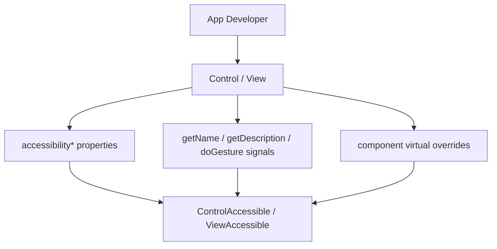
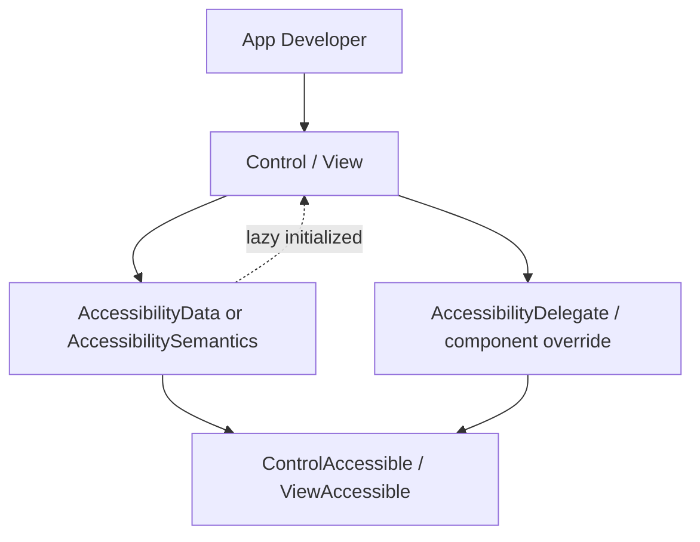

# Phase 2 - toolkit/ui Accessibility API 추가

## 목적

App 개발자가 `Control` 또는 `View` 본체에 직접 accessibility property를 흩뿌리지 않고, 별도 Accessibility object를 통해 설정하도록 새 API를 추가한다.

## 제안 형태

예시는 다음과 같은 방향이다.

```cpp
auto accessibility = control.GetAccessibilityData();
accessibility.SetName("Play");
accessibility.SetDescription("Start playback");
accessibility.SetRole(AccessibilityRole::Button);
accessibility.SetHidden(false);
accessibility.SetState(AccessibilityState::Enabled, true);
```

이름은 `AccessibilityData`, `AccessibilitySemantics`, `AccessibilityInfo` 중 하나로 정할 수 있다. 의미상으로는 `AccessibilitySemantics`가 가장 명확하지만, 기존 코드와의 연결성은 `AccessibilityData`가 좋다.

## 포함할 기능

- name
- description
- role
- value
- hidden
- highlightable
- scrollable
- modal
- states
- automation id
- attributes
- relations
- reading info type

## Virtual/Signal 처리

`AccessibilityData`는 설정 저장소로 두고, component 개발자용 동작 override는 분리하는 것이 좋다.

- App 설정: `AccessibilityData`
- Component 동작: `AccessibilityDelegate` 또는 기존 virtual override
- 동적 값: callback 또는 signal hook

즉 `GetAccessibilityData()` 객체가 모든 virtual behavior까지 품도록 만들면 lazy initialization과 component override가 충돌할 수 있다.

## Lazy Initialization

Accessibility object는 Control/View와 1:1 관계로 두고, app이 `GetAccessibilityData()` 또는 `GetAccessibilitySemantics()`를 처음 호출할 때 lazy 생성하는 방향이 좋다. 한 번 생성된 객체는 교체하지 않고 같은 handle을 계속 반환해야 한다.

App 개발자는 semantics 객체를 직접 만들어 `Set`하지 않고, Control/View가 소유한 객체의 값을 설정한다. 객체 교체를 허용하면 adaptor가 observe 중인 대상이 바뀌고, signal 재연결과 lifetime 관리가 복잡해진다.

Component가 기본 role/state/action을 정의해야 하는 경우에도 semantics 객체 생성을 강제하기보다, 기본값 provider 또는 static/default metadata로 표현하고 accessibility가 실제로 필요해질 때 materialize하는 방향이 좋다.

## 현재 코드 기준

`dali-toolkit/internal/controls/control/control-accessibility-data.h`의 `Control::AccessibilityData`는 이미 내부 lazy storage 역할을 하고 있다. name, description, value, automation id, hidden, highlightable, scrollable, modal, states, attributes, relations, reading info type, accessibility signal을 보관하고, `GetOrCreateAccessibilityData()`를 통해 필요할 때 생성된다.

따라서 Phase 2에서 완전히 새 저장소를 만들 필요는 낮다. 현재 구조는 새 `AccessibilityData` 또는 `AccessibilitySemantics` public/devel API의 내부 구현 기반으로 재사용할 수 있다.

`dali-toolkit`에서는 기존 `DevelControl::Property::ACCESSIBILITY_NAME`, `ACCESSIBILITY_ROLE` 같은 property enum value를 유지한다. 이 값들은 `dali-csharp-binder`/NUI 호환을 위한 stable identifier로 보고, 실제 저장과 처리만 새 AccessibilityData/Semantics 경로로 위임한다.

`dali-ui`는 binder ABI 호환 책임이 없으므로 가능한 한 새 AccessibilityData/Semantics API에서만 설정하도록 정리한다. 그래도 toolkit과 ui의 의미 모델은 동일하게 맞추고, 차이는 compatibility layer 유무 정도로 제한한다.

다만 현재 `Control::AccessibilityData`는 아직 최종 semantics model은 아니다.

- `ControlAccessible`에 friend로 열려 있고 `GetAccessibleObject()`를 통해 adaptor `Accessible` 계열을 직접 조회한다.
- highlight 위치 감시, property set 감시, AT-SPI event emit 보조 등 bridge에 가까운 책임도 일부 포함한다.
- state와 reading info type에 adaptor의 bitset 타입이 직접 섞여 있다.

그래서 Phase 2에서는 이 타입을 그대로 외부에 노출하기보다, 얇은 toolkit/ui-facing handle API를 만들고 내부에서 현재 `Control::AccessibilityData`에 위임하는 방향이 안전하다. `Accessible` 의존 제거와 책임 재배치는 Phase 5에서 진행한다.

## 완료 기준

- App 개발자가 접근성 속성을 새 object API로 설정할 수 있다.
- 기존 property API와 동일한 결과가 나온다.
- Toolkit과 dali-ui가 같은 개념 모델을 공유한다.
- AT-SPI 타입명이 app-facing API에 드러나지 않는다.
- 기존 internal `Control::AccessibilityData`를 재사용하되 외부 API와 adaptor 의존을 직접 노출하지 않는다.
- `dali-toolkit`의 legacy property enum/value와 binder ABI는 유지되고, `dali-ui`는 새 API 중심으로 동작한다.

## As-Is Diagram



## To-Be Diagram


