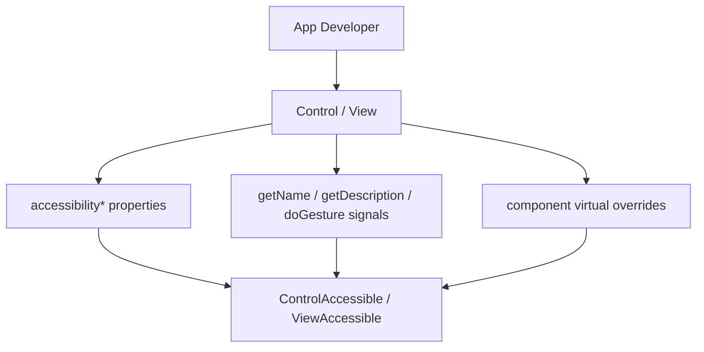
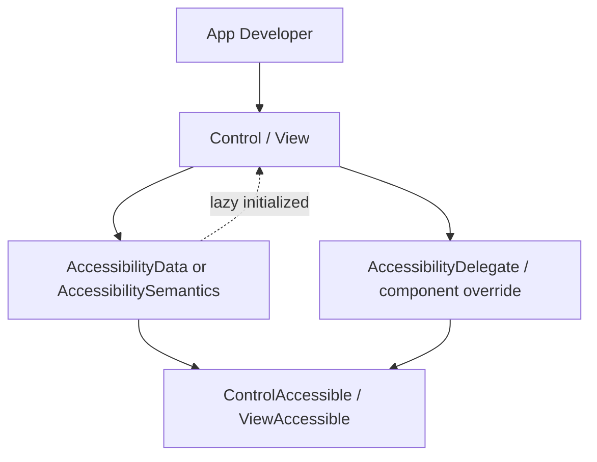

# Phase 2 - toolkit/ui Accessibility API 추가

## 목적

App 개발자가 `Control` 또는 `View` 본체에 직접 accessibility property를 흩뿌리지 않고, 별도 Accessibility object를 통해 설정하도록 새 API를 추가한다.

## 제안 형태

예시는 다음과 같은 방향이다.

```cpp
auto accessibility = control.GetAccessibilityData();
accessibility.SetName("Play");
accessibility.SetDescription("Start playback");
accessibility.SetRole(AccessibilityRole::Button);
accessibility.SetHidden(false);
accessibility.SetState(AccessibilityState::Enabled, true);
```

이름은 `AccessibilityData`, `AccessibilitySemantics`, `AccessibilityInfo` 중 하나로 정할 수 있다. 의미상으로는 `AccessibilitySemantics`가 가장 명확하지만, 기존 코드와의 연결성은 `AccessibilityData`가 좋다.

## 포함할 기능

- name
- description
- role
- value
- hidden
- highlightable
- scrollable
- modal
- states
- automation id
- attributes
- relations
- reading info type

## Virtual/Signal 처리

`AccessibilityData`는 설정 저장소로 두고, component 개발자용 동작 override는 분리하는 것이 좋다.

- App 설정: `AccessibilityData`
- Component 동작: `AccessibilityDelegate` 또는 기존 virtual override
- 동적 값: callback 또는 signal hook

즉 `GetAccessibilityData()` 객체가 모든 virtual behavior까지 품도록 만들면 lazy initialization과 component override가 충돌할 수 있다.

## Lazy Initialization

Accessibility object는 Control/View와 1:1 관계로 두고, app이 `GetAccessibilityData()` 또는 `GetAccessibilitySemantics()`를 처음 호출할 때 lazy 생성하는 방향이 좋다. 한 번 생성된 객체는 교체하지 않고 같은 handle을 계속 반환해야 한다.

App 개발자는 semantics 객체를 직접 만들어 `Set`하지 않고, Control/View가 소유한 객체의 값을 설정한다. 객체 교체를 허용하면 adaptor가 observe 중인 대상이 바뀌고, signal 재연결과 lifetime 관리가 복잡해진다.

Component가 기본 role/state/action을 정의해야 하는 경우에도 semantics 객체 생성을 강제하기보다, 기본값 provider 또는 static/default metadata로 표현하고 accessibility가 실제로 필요해질 때 materialize하는 방향이 좋다.

## 완료 기준

- App 개발자가 접근성 속성을 새 object API로 설정할 수 있다.
- 기존 property API와 동일한 결과가 나온다.
- Toolkit과 dali-ui가 같은 개념 모델을 공유한다.
- AT-SPI 타입명이 app-facing API에 드러나지 않는다.

## As-Is Diagram



## To-Be Diagram


