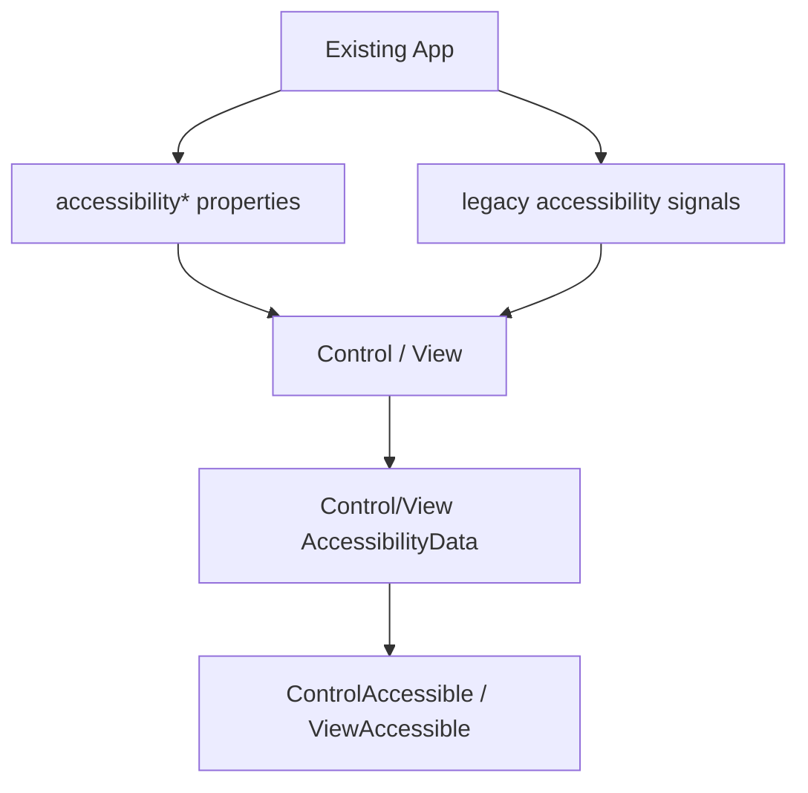
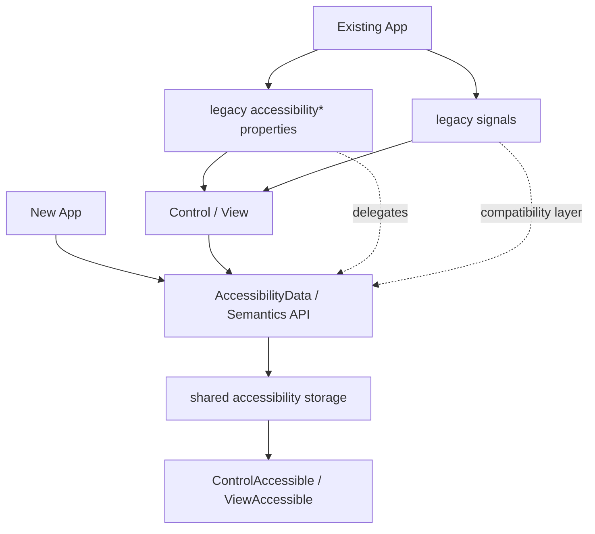

# Phase 3 - 기존 Control/View API 위임

## 목적

기존 `Control`/`View` accessibility property와 signal을 유지하되, 내부 구현은 새 Accessibility object API로 위임한다. 사용자의 기존 코드는 깨지지 않아야 한다.

## 작업 방향

- `accessibilityName` property set/get은 새 AccessibilityData의 name으로 위임한다.
- `accessibilityDescription`, `accessibilityRole`, `accessibilityHidden` 등 기존 property도 같은 방식으로 위임한다.
- 기존 signal은 compatibility layer로 유지한다.
- 새 API를 문서상 권장 경로로 둔다.
- 기존 property set이 필요할 때는 `GetAccessibilityData()`를 통해 동일한 lazy 객체를 생성하거나 가져와서 값을 설정한다.
- 기본값 또는 component-defined metadata만 있는 경우에는 불필요하게 AccessibilityData 객체를 만들지 않도록 `PeekAccessibilityData()` 같은 내부 조회 경로를 둘 수 있다.

## Deprecated 처리

기존 property는 바로 제거하지 않는다.

- 1단계: 새 API 추가, 기존 API 유지.
- 2단계: 문서에서 기존 API를 legacy로 표시.
- 3단계: 내부 구현을 새 API로 통합.
- 4단계: 필요 시 장기 deprecated 계획 수립.

## 주의점

기존 property는 스타일 시스템, scripting, builder, test code에서 쓰일 수 있다. API 모양만 바꿔도 사용처가 넓으므로 호환 경로가 필요하다.

기존 property API가 새 object API로 위임되더라도 semantics 객체는 Control/View와 1:1로 유지되어야 한다. `SetAccessibilityData(newObject)`처럼 객체 자체를 교체하는 API는 observer 재연결 문제를 만들 수 있으므로 피하는 편이 좋다.

## 완료 기준

- 기존 property 기반 앱이 동일하게 동작한다.
- 새 object API와 기존 property API가 같은 저장소를 본다.
- Toolkit과 dali-ui의 접근성 저장 방식이 정리된다.

## As-Is Diagram

## To-Be Diagram

